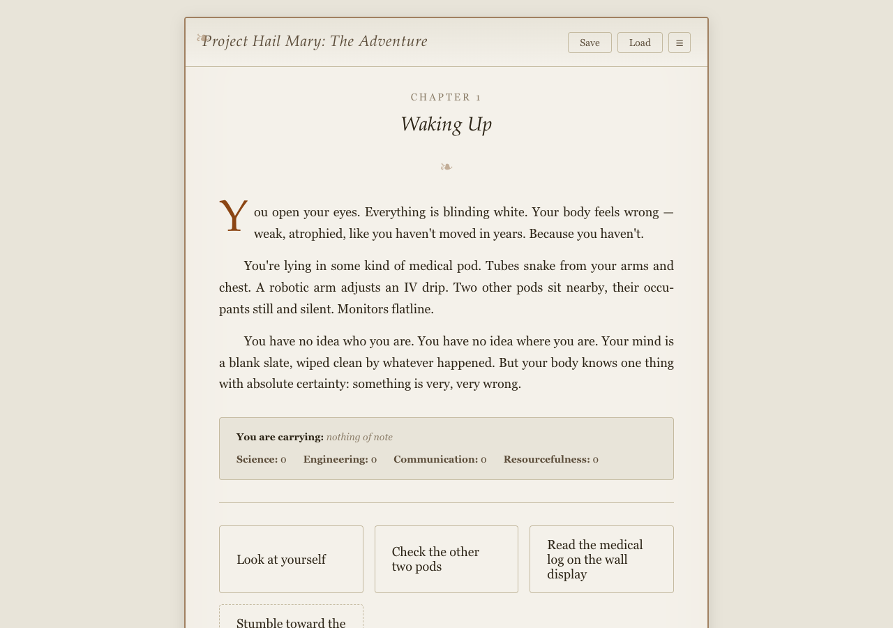

# Book Adventure

Transform PDF books into playable text adventure games using AI.

Book Adventure uses Claude to analyze a book's characters, locations, and plot, then generates a fully interactive text adventure game that can be played in any browser — no server required.



## Live Demos

Try the generated games:

- [Moby Dick](https://book-adventure-moby-dick.netlify.app) — Hunt the white whale across the open seas
- [Project Hail Mary](https://book-adventure-hail-mary.netlify.app) — Save humanity on an interstellar mission

## How It Works

1. **Run the CLI** with a PDF and your Claude API key
2. **AI analyzes the book** — extracts characters, locations, plot points, and story structure
3. **Game JSON is generated** — a complete game data file with nodes, interactions, and state
4. **Play it** — open the runtime with the generated game data in any browser

## Project Structure

This is a monorepo with two packages:

```
packages/
├── generator/   # CLI tool — PDF parsing, AI analysis, game generation
└── runtime/     # Vanilla TypeScript game engine — plays generated games in the browser
```

### Generator (`@book-adventure/generator`)

A CLI tool that takes a PDF book and produces a complete game data JSON file. Uses Claude to summarize the story, extract characters/locations/plot, and generate an interactive game structure.

### Runtime (`@book-adventure/runtime`)

A standalone game engine that powers the text adventures. Builds to a single IIFE bundle for embedding in HTML. Features include:

- Story node navigation with branching choices
- Inventory and item management
- Character relationships and dialogue
- Conditional logic and state tracking
- Save/load with LocalStorage and auto-save

## Prerequisites

- [Node.js](https://nodejs.org/) (v18+)
- An [Anthropic API key](https://console.anthropic.com/) for Claude

## Getting Started

```bash
# Install dependencies
npm install

# Generate a game from a PDF
npm run generate -- --pdf ./book.pdf --api-key $ANTHROPIC_API_KEY

# Or use the environment variable
export ANTHROPIC_API_KEY=sk-ant-xxx
npm run generate -- --pdf ./book.pdf
```

## CLI Usage

```bash
npm run generate -- [options]
```

| Option | Description |
|---|---|
| `--pdf, -p` | Path to PDF file (required) |
| `--api-key, -k` | Anthropic API key (or set `ANTHROPIC_API_KEY` env var) |
| `--output, -o` | Output JSON path (default: `<book>.game.json`) |
| `--chunked, -c` | Use chunked generation for large books |
| `--verbose, -v` | Show detailed progress |
| `--help, -h` | Show help |

### Examples

```bash
# Basic usage
npm run generate -- -p moby-dick.pdf -k sk-ant-xxx

# Large book with verbose output
npm run generate -- -p war-and-peace.pdf -c -v

# Custom output path
npm run generate -- -p moby-dick.pdf -o my-game.json
```

## Scripts

| Command | Description |
|---|---|
| `npm run generate -- [options]` | Generate a game from a PDF |
| `npm run build:runtime` | Build the runtime engine |

## Tech Stack

- **AI:** Anthropic Claude API (`@anthropic-ai/sdk`)
- **PDF Parsing:** unpdf
- **CLI Runner:** tsx
- **Runtime:** Vanilla TypeScript (IIFE bundle)

## License

MIT
